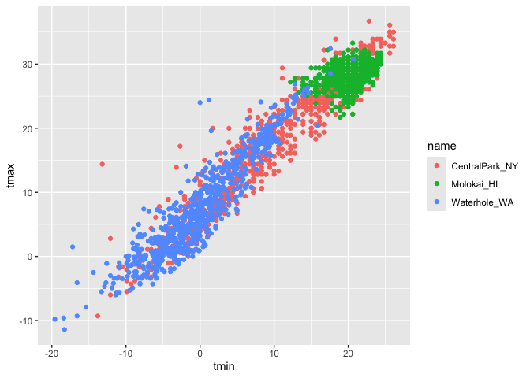
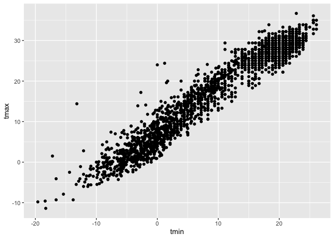
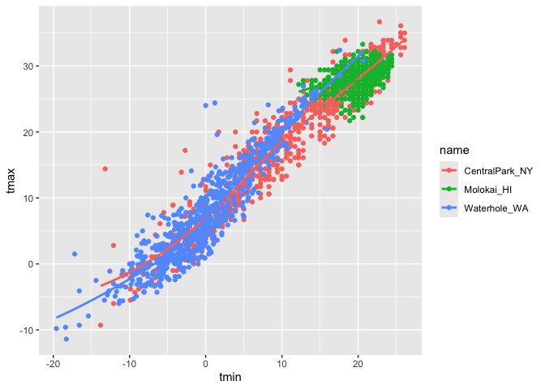
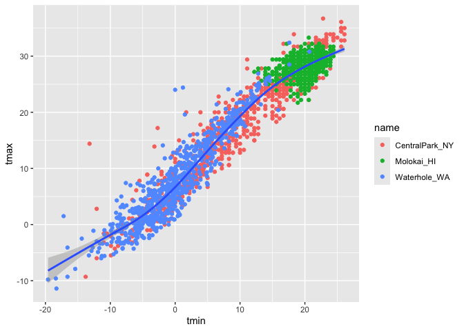
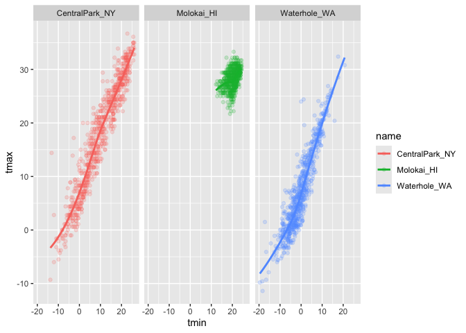

01_vizualization
================

``` r
library(tidyverse)
```

    ## ── Attaching core tidyverse packages ──────────────────────── tidyverse 2.0.0 ──
    ## ✔ dplyr     1.2.1     ✔ readr     2.2.0
    ## ✔ forcats   1.0.1     ✔ stringr   1.6.0
    ## ✔ ggplot2   4.0.3     ✔ tibble    3.3.1
    ## ✔ lubridate 1.9.5     ✔ tidyr     1.3.2
    ## ✔ purrr     1.2.2     
    ## ── Conflicts ────────────────────────────────────────── tidyverse_conflicts() ──
    ## ✖ dplyr::filter() masks stats::filter()
    ## ✖ dplyr::lag()    masks stats::lag()
    ## ℹ Use the conflicted package (<http://conflicted.r-lib.org/>) to force all conflicts to become errors

``` r
library(ggridges)
```

``` r
library(p8105.datasets)
data("weather_df")
```

Now we have everything we need!

\##Scatter plots!

Create my first scatterplot

``` r
ggplot(weather_df, aes(x = tmin, y = tmax)) +
  geom_point()
```

    ## Warning: Removed 17 rows containing missing values or values outside the scale range
    ## (`geom_point()`).

<!-- -->
geom_point() = scatterplot

I always like the dataframe first

``` r
ggp_temp_scatterplot =
weather_df |> 
  ggplot(aes(x = tmin, y =tmax)) +
  geom_point()
```

If you want to save plots name it and export it in a different way. One
base plot and save it in a different way Same as 40. New approach, same
plot

``` r
weather_df |> 
  ggplot(aes(x = tmin, y = tmax))+
  geom_point()
```

    ## Warning: Removed 17 rows containing missing values or values outside the scale range
    ## (`geom_point()`).

<!-- -->

Make it prettier

``` r
ggp_temp_scatterplot =
weather_df |> 
  ggplot(aes(x = tmin, y =tmax, color = name)) +
  geom_point()
ggp_temp_scatterplot
```

    ## Warning: Removed 17 rows containing missing values or values outside the scale range
    ## (`geom_point()`).

<!-- -->
alpha = alpha blending. Just makes points more transparent. Add
geomsmoothe to create a line through the dataset

See and edit a plot object

``` r
weather_plot =
  weather_df |> 
  ggplot(aes(x = tmin, y = tmax))

weather_plot + geom_point()
```

    ## Warning: Removed 17 rows containing missing values or values outside the scale range
    ## (`geom_point()`).

<!-- -->

## Advanced scatterplot….

Start with the same one and make it fancy

``` r
weather_plot =
  weather_df |> 
  ggplot(aes(x = tmin, y = tmax, color = name)) +
  geom_point() + 
  geom_smooth(se = FALSE)
weather_plot
```

    ## `geom_smooth()` using method = 'loess' and formula = 'y ~ x'

    ## Warning: Removed 17 rows containing non-finite outside the scale range
    ## (`stat_smooth()`).

    ## Warning: Removed 17 rows containing missing values or values outside the scale range
    ## (`geom_point()`).

<!-- -->

What about the ‘aes’ placement ? Although ggplot knows the axes, but it
knows that aesthetics is defined in the points. Aesthetics defined can
be defined here or can change placement

``` r
weather_plot =
  weather_df |> 
  ggplot(aes(x = tmin, y = tmax)) +
  geom_point(aes(color = name)) + 
  geom_smooth()
weather_plot
```

    ## `geom_smooth()` using method = 'gam' and formula = 'y ~ s(x, bs = "cs")'

    ## Warning: Removed 17 rows containing non-finite outside the scale range
    ## (`stat_smooth()`).

    ## Warning: Removed 17 rows containing missing values or values outside the scale range
    ## (`geom_point()`).

<!-- -->

Let’s facet some things:

``` r
weather_plot =
  weather_df |> 
  ggplot(aes(x = tmin, y = tmax, color = name)) +
  geom_point(alpha = 0.2) + 
  geom_smooth(se = FALSE, size = 1) +
  facet_grid(. ~ name)
```

    ## Warning: Using `size` aesthetic for lines was deprecated in ggplot2 3.4.0.
    ## ℹ Please use `linewidth` instead.
    ## This warning is displayed once per session.
    ## Call `lifecycle::last_lifecycle_warnings()` to see where this warning was
    ## generated.

``` r
weather_plot
```

    ## `geom_smooth()` using method = 'loess' and formula = 'y ~ x'

    ## Warning: Removed 17 rows containing non-finite outside the scale range
    ## (`stat_smooth()`).

    ## Warning: Removed 17 rows containing missing values or values outside the scale range
    ## (`geom_point()`).

<!-- -->
Facet grid . = rows (nothing defines rows), don’t create rows name =
define column

If reverse should have rows and not columns. in geompoint want to make
the individual points more visible: geompoint and geomsomothe can use
alspha level to be related to other things if you don’t map that to a
specific variable in the ggplot then set a univeral one in geom point

Let’s combine some elements and try a new plot.

``` r
weather_df |> 
  ggplot(aes(x=date, y = tmax, color = name)) +
  geom_point(aes(size = prcp), alpha = 0.5)+
  geom_smooth(se = FALSE)+
  facet_grid(. ~ name)
```

    ## `geom_smooth()` using method = 'loess' and formula = 'y ~ x'

    ## Warning: Removed 17 rows containing non-finite outside the scale range
    ## (`stat_smooth()`).

    ## Warning: Removed 19 rows containing missing values or values outside the scale range
    ## (`geom_point()`).

<!-- -->
