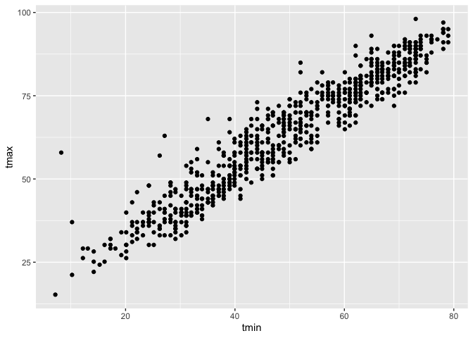
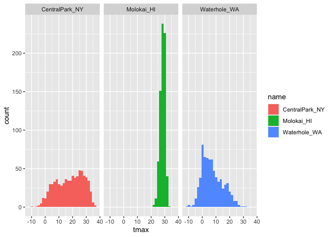
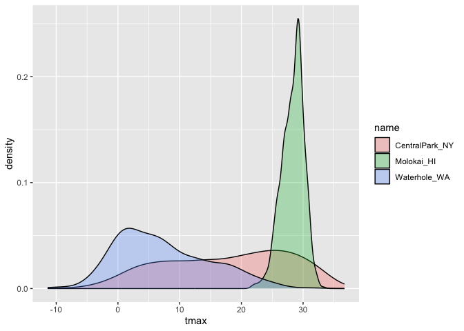

Class notes
================
Risa Dickerman
2026-10-01

``` r
library(tidyverse)
```

    ## ── Attaching core tidyverse packages ──────────────────────── tidyverse 2.0.0 ──
    ## ✔ dplyr     1.2.1     ✔ readr     2.2.0
    ## ✔ forcats   1.0.1     ✔ stringr   1.6.0
    ## ✔ ggplot2   4.0.3     ✔ tibble    3.3.1
    ## ✔ lubridate 1.9.5     ✔ tidyr     1.3.2
    ## ✔ purrr     1.2.2     
    ## ── Conflicts ────────────────────────────────────────── tidyverse_conflicts() ──
    ## ✖ dplyr::filter() masks stats::filter()
    ## ✖ dplyr::lag()    masks stats::lag()
    ## ℹ Use the conflicted package (<http://conflicted.r-lib.org/>) to force all conflicts to become errors

``` r
library(ggridges)
```

``` r
library(p8105.datasets)
data("weather_df")
```

Now we have everything we need!

\##Scatter plots!

Create my first scatterplot

``` r
ggplot(weather_df, aes(x = tmin, y = tmax)) +
  geom_point()
```

    ## Warning: Removed 17 rows containing missing values or values outside the scale range
    ## (`geom_point()`).

<!-- -->
geom_point() = scatterplot

I always like the dataframe first

``` r
ggp_temp_scatterplot =
weather_df |> 
  ggplot(aes(x = tmin, y =tmax)) +
  geom_point()
```

If you want to save plots name it and export it in a different way. One
base plot and save it in a different way Same as 40.

Make it prettier

``` r
ggp_temp_scatterplot =
weather_df |> 
  ggplot(aes(x = tmin, y =tmax, color = name)) +
  geom_point()
ggp_temp_scatterplot
```

    ## Warning: Removed 17 rows containing missing values or values outside the scale range
    ## (`geom_point()`).

<!-- --> alpha =
alpha blending. Just makes points more transparent. Add geomsmoothe to
create a line through the dataset

``` r
weather_plot =
  weather_df |> 
  ggplot(aes(x = tmin, y = tmax, color = name)) +
  geom_point() + 
  geom_smooth(se = FALSE)
weather_plot
```

    ## `geom_smooth()` using method = 'loess' and formula = 'y ~ x'

    ## Warning: Removed 17 rows containing non-finite outside the scale range
    ## (`stat_smooth()`).

    ## Warning: Removed 17 rows containing missing values or values outside the scale range
    ## (`geom_point()`).

<!-- -->

``` r
weather_plot =
  weather_df |> 
  ggplot(aes(x = tmin, y = tmax, color = name)) +
  geom_point(aes(color = name), alpha = 0.25) + 
  geom_smooth(se = FALSE)
weather_plot
```

    ## `geom_smooth()` using method = 'loess' and formula = 'y ~ x'

    ## Warning: Removed 17 rows containing non-finite outside the scale range
    ## (`stat_smooth()`).

    ## Warning: Removed 17 rows containing missing values or values outside the scale range
    ## (`geom_point()`).

<!-- --> where
you put aesthetics matters. Aesthetics are up to you

``` r
weather_plot =
  weather_df |> 
  ggplot(aes(x = tmin, y = tmax, color = name)) + 
  geom_smooth(se = FALSE)
weather_plot
```

    ## `geom_smooth()` using method = 'loess' and formula = 'y ~ x'

    ## Warning: Removed 17 rows containing non-finite outside the scale range
    ## (`stat_smooth()`).

<!-- --> Don’t
have to have a scatterplot for example above. Can just have the mean
lines

Show faceting

``` r
gg_weather = 
weather_df |> 
  ggplot(aes(x = tmin, y = tmax, color = name)) +
  geom_point(alpha = 0.5) +
  facet_grid(. ~ name)
gg_weather
```

    ## Warning: Removed 17 rows containing missing values or values outside the scale range
    ## (`geom_point()`).

<!-- -->
Splitting plots on name from dataset.

Both above and below work the same

``` r
gg_weather = 
weather_df |> 
  ggplot(aes(x = tmin, y = tmax, color = name)) +
  geom_point(alpha = 0.5) +
  facet_grid( cols = vars(name))
gg_weather
```

    ## Warning: Removed 17 rows containing missing values or values outside the scale range
    ## (`geom_point()`).

<!-- -->

Let’s look at something else

``` r
weather_df |> 
   ggplot(aes(x = date, y = tmax, color = name)) +
  geom_point(aes(size = prcp), alpha = 0.5) +
  geom_smooth(se = FALSE) +
  facet_grid(. ~ name)
```

    ## `geom_smooth()` using method = 'loess' and formula = 'y ~ x'

    ## Warning: Removed 17 rows containing non-finite outside the scale range
    ## (`stat_smooth()`).

    ## Warning: Removed 19 rows containing missing values or values outside the scale range
    ## (`geom_point()`).

<!-- -->

make a plot of central park tmax v tmin only, and convert temperatures
to fahrnenheit.

``` r
weather_df |> 
  filter(name == "CentralPark_NY") |> 
  mutate(tmax = 9/5 *tmax +32,
    tmin = 9/5 *tmin +32) |> 
  ggplot(aes(x = tmin, y = tmax)) +
  geom_point()
```

<!-- -->

What’s a hex plot

``` r
weather_df |> 
  ggplot(aes(x = tmin, y = tmax)) +
  geom_hex()
```

    ## Warning: Removed 17 rows containing non-finite outside the scale range
    ## (`stat_binhex()`).

<!-- -->

## Univariate plots

Histogram

``` r
weather_df |> 
  ggplot(aes(x = tmax)) +
  geom_histogram()
```

    ## `stat_bin()` using `bins = 30`. Pick better value `binwidth`.

    ## Warning: Removed 17 rows containing non-finite outside the scale range
    ## (`stat_bin()`).

<!-- -->

Create histogram with different names

``` r
weather_df |> 
  ggplot(aes(x = tmax, fill = name)) +
  geom_histogram()+
  facet_grid(. ~ name)
```

    ## `stat_bin()` using `bins = 30`. Pick better value `binwidth`.

    ## Warning: Removed 17 rows containing non-finite outside the scale range
    ## (`stat_bin()`).

<!-- --> color
around edges bc for histogram the color is the edge of the bar. instead
do fill to get whole one position(dodge) Just visual comparison group to
group. Reading horizontally is harder than reading otherways. So not the
best for facet_grid

\#Density plots Density plots are great!! (Density = smoothed out
histogram)

``` r
weather_df |> 
  ggplot(aes(x = tmax, fill = name)) +
    geom_density(alpha = 0.3)
```

    ## Warning: Removed 17 rows containing non-finite outside the scale range
    ## (`stat_density()`).

<!-- --> Easier
to see what the overlapping peices are. See each one individually and as
a group Can do color outside or fill but it will cover up. Use alpha to
make things transparent

\#Boxplots

``` r
weather_df |> 
  ggplot(aes(x = name, y = tmax)) +
  geom_boxplot()
```

    ## Warning: Removed 17 rows containing non-finite outside the scale range
    ## (`stat_boxplot()`).

<!-- -->

\#Violin plot

``` r
weather_df |> 
  ggplot(aes(x = name, y = tmax)) +
  geom_violin()
```

    ## Warning: Removed 17 rows containing non-finite outside the scale range
    ## (`stat_ydensity()`).

<!-- --> Violin
shows you a little bit more information than boxplots. Sometimes bimodal
distribution but won’t be able to pick up on it

\#Ridge plots

``` r
weather_df |> 
  ggplot(aes(x = tmax, y = name)) +
  geom_density_ridges()
```

    ## Picking joint bandwidth of 1.54

    ## Warning: Removed 17 rows containing non-finite outside the scale range
    ## (`stat_density_ridges()`).

<!-- --> Ridge
plots - imagine starting with a density, what’s showing up here is just
the overall density of everything. Could stack or could make the much
more exciting ridges. Once overlapping with color. With many data hard
to look at everything so it’s more useful to separate them out rather
than just density plots
